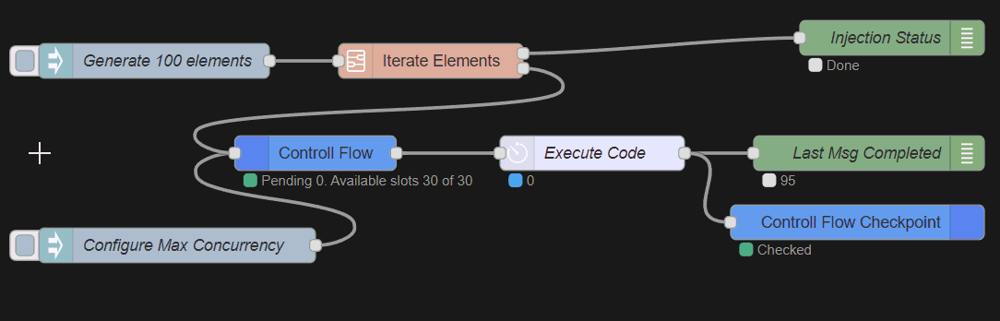

# Event Manager Dispatcher

Event Manager dispatcher for Node Red

[![Donate][donation-badge]](https://www.buymeacoffee.com/siglesiasg)

[donation-badge]: https://img.shields.io/badge/Buy%20me%20a%20pizza-%23d32f2f?logo=buy-me-a-coffee&style=flat&logoColor=white

## Overview

This repository contains custom nodes for Node-RED that enhance event management capabilities. The nodes include:

- **Event Manager Dispatcher:** Emits messages based on slot availability, storing them in memory until a free slot becomes available. Configuration options include dynamic updates for maximum concurrency.

- **Event Manager Checkpoint:** Allows marking the completion of message execution and enables the emission of new messages from the `event-manager-dispatcher` node.

### Key Features

- Efficient event management for Node-RED flows.
- Dynamic configuration for maximum concurrency.
- Seamless integration with the Node-RED environment.

## Example

## Donate
Do you like my work? Buy me a coffee - or pizza 😜🍕

[![Donate][donation-badge-2]](https://www.buymeacoffee.com/siglesiasg)

[donation-badge-2]: ./readme-assets/bmc_qr.png

## License 
Source code files are made available under the Apache License, Version 2.0 (Apache-2.0), located in the [LICENSE] file.
